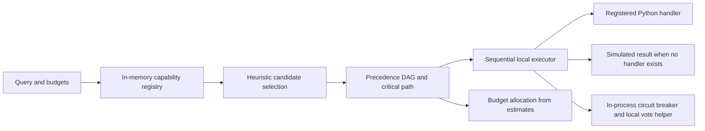
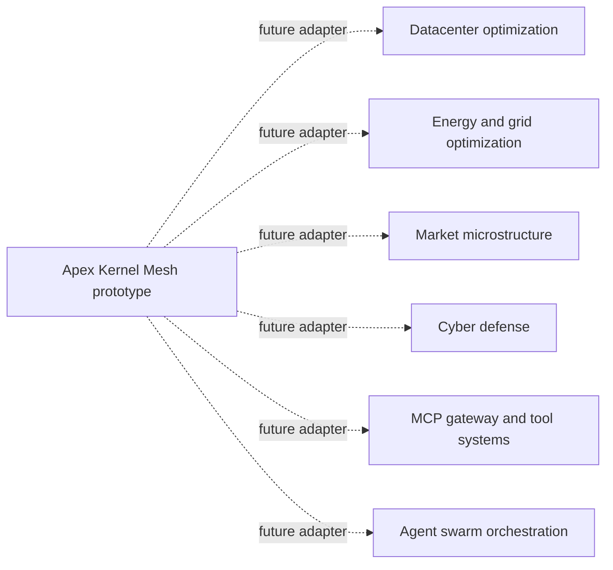

# Apex Kernel Mesh

Apex Kernel Mesh is a zero-runtime-dependency Python prototype for discovering capability metadata, selecting candidate capabilities, planning dependency DAGs, and allocating estimated latency budgets. Its current executor runs sequentially and simulates a stage when no local Python handler is registered. It does not yet connect to remote kernels or MCP servers.

[](https://github.com/AAH20/apex-kernel-mesh/actions/workflows/ci.yml)
[](https://www.python.org/)
[](https://github.com/AAH20/apex-kernel-mesh)
[](LICENSE)

## What works today

- An in-memory registry for kernel and capability metadata, with local text/domain search.
- Heuristic candidate selection under estimated token and latency budgets. The greedy strategy is a heuristic and has no approximation guarantee. The bounded `exact` strategy enumerates candidate subsets and can take exponential time.
- Topological ordering and critical-path calculations for precedence-only DAGs, assuming unlimited execution resources.
- Sequential execution of planned stages through registered in-process Python handlers, with synthetic `simulated` results for unhandled stages.
- In-process circuit-breaker state, a local majority-vote helper, and proportional/water-filling budget allocation over supplied estimates.
- A synthetic microbenchmark and command-line examples for these local operations.

## What it does not do yet

There are no MCP, HTTP, stdio, RPC, model-provider, or remote solver adapters. The project does not execute stages concurrently, solve resource-constrained job-shop scheduling, provide distributed circuit breaking or Byzantine consensus, or guarantee latency SLAs. Estimates and benchmark results are not production measurements. See [architecture and execution contract](docs/architecture.md) for details and future adapter requirements.

## Architecture



The repository contains six small subsystems. Their current behavior is summarized below; names describe implementation areas, not claims that general NP-hard problems are solved optimally.

| Module | Current behavior | Important limit |
|:---|:---|:---|
| `registry.py` | In-memory capability metadata and search | No remote discovery or persistence |
| `router.py` | Heuristic relevance/domain selection with token and latency estimate filters | Relevance and costs are heuristic; bounded exact enumeration is exponential |
| `composer.py` | Topological ordering and critical-path analysis | Precedence-only DAG; unlimited resources |
| `executor.py` | Sequential local handler dispatch or synthetic simulation | No transport adapters or parallel execution |
| `health.py` | In-process circuit breaker and local majority helper | Not distributed fault tolerance or Byzantine consensus |
| `balancer.py` | Budget allocation over supplied stage estimates | Allocation is not a prediction or SLA |
| `benchmark.py` | Synthetic local microbenchmarks | Not representative of external systems or production workloads |

## Install and run

Python 3.10 or later is required. The package has no third-party runtime dependencies. Building a wheel from source uses the build backend declared in `pyproject.toml`.

```bash
git clone https://github.com/AAH20/apex-kernel-mesh.git
cd apex-kernel-mesh

# Run tests
python -m unittest discover -s tests -v

# Run the synthetic benchmark
python -m apex_kernel_mesh.cli benchmark

# Inspect the sample registry
python -m apex_kernel_mesh.cli registry

# Try local capability selection
python -m apex_kernel_mesh.cli route "optimize power scheduling"

# Inspect a sample DAG plan
python -m apex_kernel_mesh.cli compose
```

To install the command-line entry point from a checkout:

```bash
python -m pip install .
apex-kernel-mesh --help
```

## Interpreting benchmark output

The benchmark creates a synthetic in-memory registry (8 sample kernels and 24 capability descriptors) and measures operations in the current process. Timing depends on Python, hardware, and system load. The default sample count is too small for a stable p99; the reported upper percentile is effectively the maximum observation. Token-reduction output uses estimated capability token counts against the benchmark's filtered candidate set, not an actual tokenizer or provider bill.

Use the output as a development smoke benchmark. See [benchmark methodology](docs/benchmarks.md) for what is needed before making performance or cost comparisons. Do not interpret these values as latency guarantees, unit economics, or external-kernel results.

## Integration direction

The project is structured so adapters could later connect independent solver repositories, MCP servers, or other capability providers. The repositories below are possible integration targets only; they are not currently imported, called, or benchmarked by this codebase.



A production adapter needs versioned input/output schemas, explicit transport and timeout behavior, authentication and secret handling, retry/idempotency semantics, cancellation, health signals, observability, and measured cost/latency provenance. The executor must also expose whether a result was planned, simulated, dispatched, succeeded, failed, or timed out. These are future work, not shipped features.

## Development checks

```bash
python -m unittest discover -s tests -v
python -m pip wheel --no-deps --wheel-dir dist .
```

GitHub Actions runs the test suite and builds/installs a wheel on Python 3.10, 3.11, 3.12, and 3.13. The workflow badge reflects that workflow, rather than a manually maintained test count.

## License

This project is licensed under the Apache License 2.0. See [LICENSE](LICENSE).
