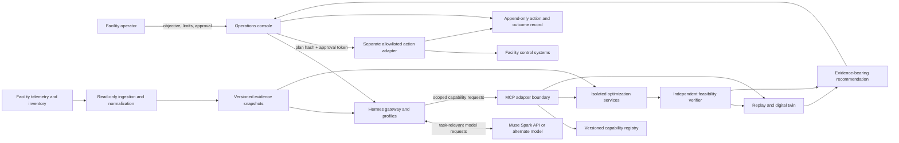
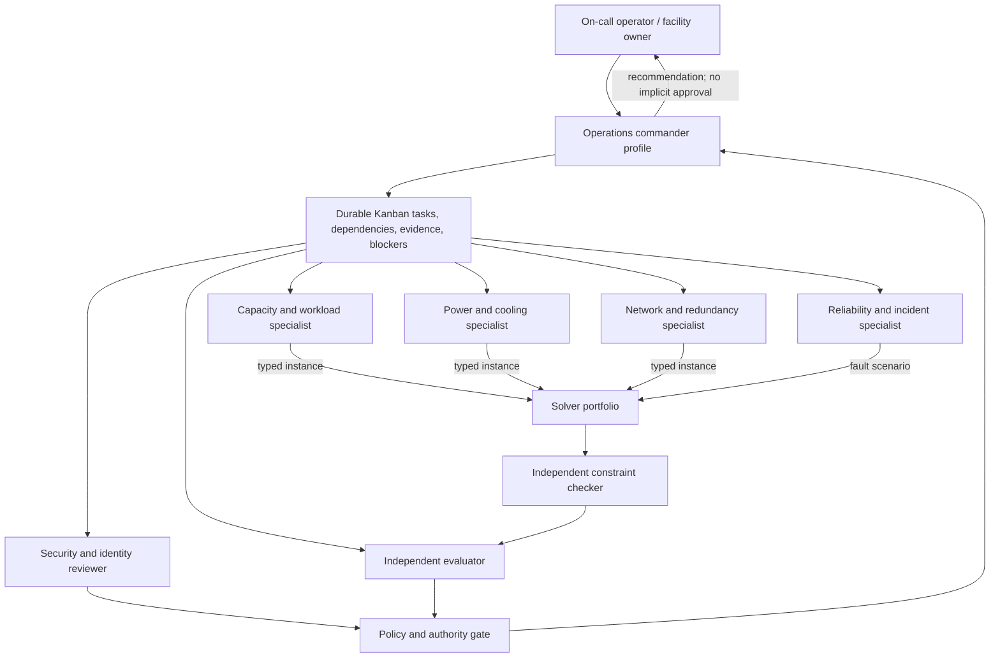
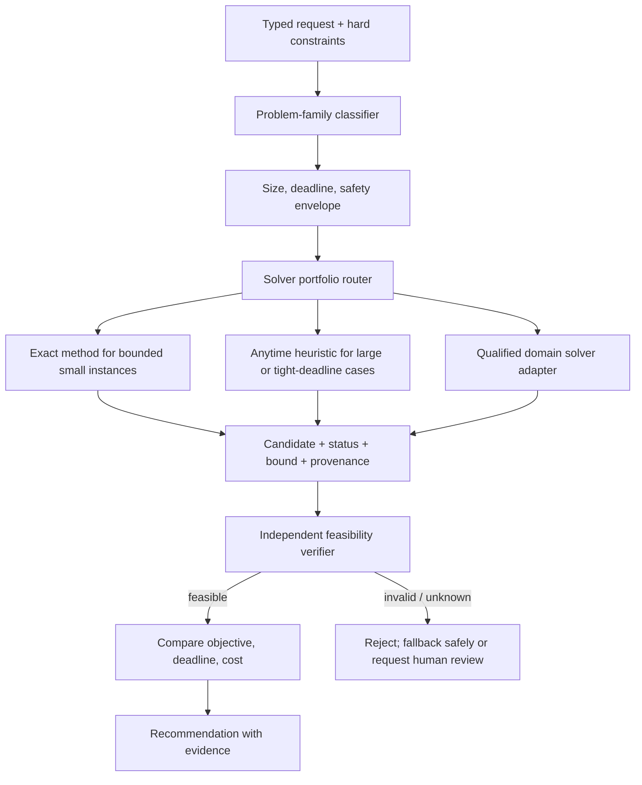
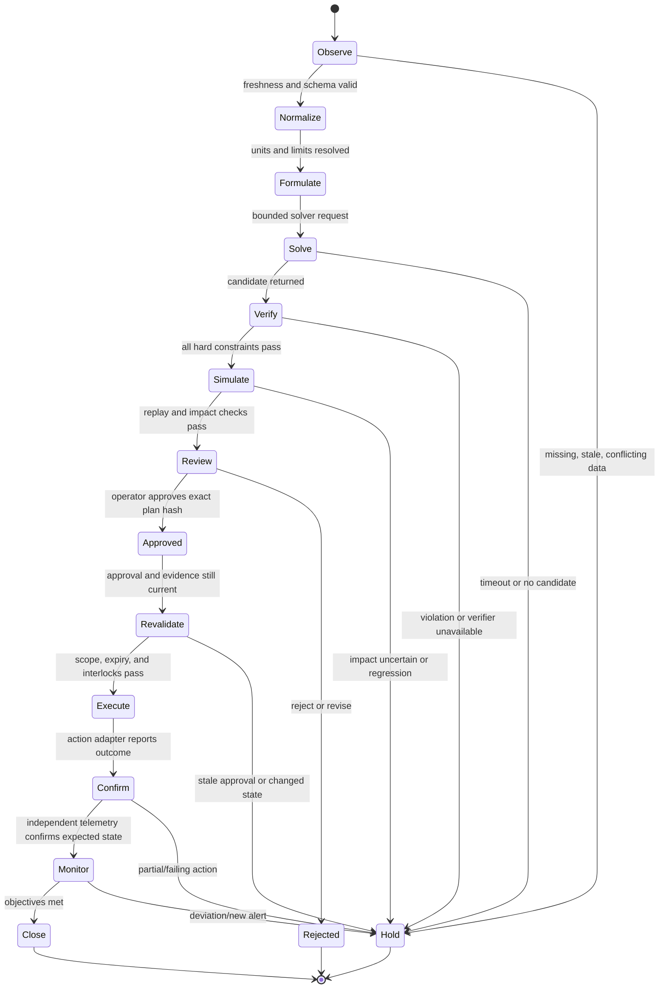
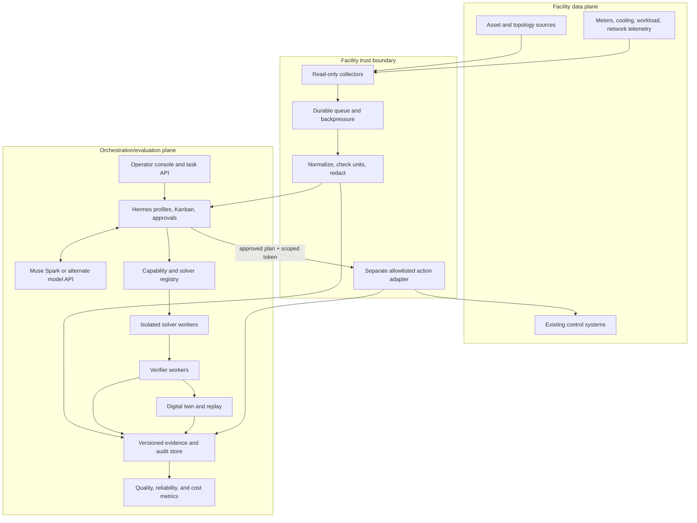
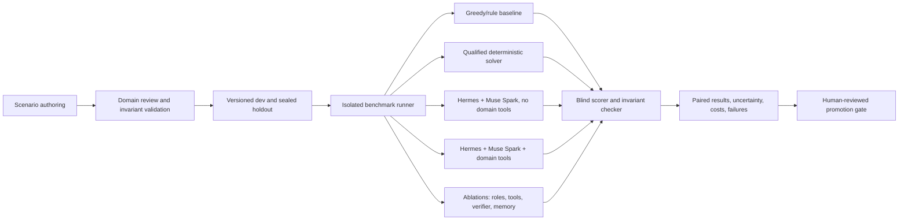
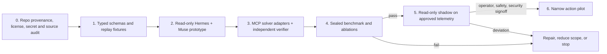

# Data Center Operations with Hermes and Muse Spark

**Status:** proposed architecture, not an implemented integration or a validated performance claim.

Meta's multi-agent cookbook pairs `muse-spark-1.3` as the model with Hermes as the harness, using specialist profiles and a durable Kanban workflow. This document adapts that pattern to data-center operations. The current Apex Kernel Mesh remains a local prototype: its registry and routing are in-memory, its executor is sequential or simulates unhandled work, and it has no production MCP, solver, telemetry, or facility-control adapters.

## Design goals

- Turn repositories into versioned, tested capabilities; do not load the whole portfolio into every context.
- Separate reasoning, optimization, independent verification, and physical actuation.
- Start in read-only replay or digital-twin mode. Require named human approval for live changes.
- Bind every recommendation to telemetry snapshots, constraints, software/model versions, solver status, and approvals.
- Treat feasibility and safety invariants as hard gates. Optimize business objectives only inside the feasible region.
- Compare model/harness/tool effects fairly and publish failures as well as wins.

## 1. System context and trust boundaries



Telemetry ingestion is read-only. The model receives only task-relevant, sanitized context. Optimization workers do not hold facility-control credentials. The action adapter is isolated and requires an operator authorization bound to an exact plan. These are design requirements, not existing capabilities.

## 2. Hierarchical specialist topology

Profiles are workflow roles, not proof of independent expertise. Skills provide procedures; MCP provides bounded tools; tested solver code provides optimization behavior.



| Role | Scope | Authority boundary |
|---|---|---|
| Operations commander | Clarify objectives, decompose, resolve conflicts, package evidence | Cannot certify solver correctness or actuate |
| Capacity/workload | Placement and scheduling proposals | Cannot silently relax capacity or service constraints |
| Power/cooling | Feasible energy and thermal proposals | Cannot invent limits or write setpoints |
| Network/reliability | Topology, routing, failure, and recovery analysis | Must disclose stale or incomplete topology |
| Security reviewer | Identity, policy, and tool permission review | Cannot grant itself privileges |
| Evaluator | Blind fixtures, verifier results, cost, and evidence | Cannot tune on sealed holdouts |
| Operator | Review exact plan and approve/reject | Cannot be bypassed by retries or another agent |

Add agents only when ablation shows their quality benefit exceeds inference, coordination, and review costs.

## 3. Repository intake and promotion gates

Start with a portfolio index, not hundreds of live tools. Keep original/fork, public/private, archived/active, and licensed/unverified states distinct. Verify implementation from source, tests, license, and reproducible behavior; never infer capability from repository names.

```mermaid
flowchart LR
    INV[Git repository inventory] --> META[Metadata, ownership, privacy, license]
    META --> GATE{Eligible and safe to inspect?}
    GATE -->|private / strategic| PRIVATE[Private local index only]
    GATE -->|fork| UP[Upstream and license review]
    GATE -->|original candidate| STATIC[Static review, secret scan, license check]
    UP --> STATIC
    STATIC --> TEST[Reproduce build and tests]
    TEST --> CONTRACT[Define typed input/output contract]
    CONTRACT --> REPLAY[Replay fixtures and independent checks]
    REPLAY --> EVIDENCE[Quality, latency, resource, maintenance evidence]
    EVIDENCE -->|passes| REGISTRY[Versioned capability registry]
    EVIDENCE -->|gaps| BACKLOG[Repair, hold, or archive]
    REGISTRY --> SKILL[Skill if procedure is reusable]
    REGISTRY --> MCP[MCP adapter if callable contract is stable]
    SKILL --> PROFILE[Versioned Hermes profile distribution]
    MCP --> PROFILE
```



Example manifest (placeholders require source review):

```yaml
capability_id: dc.capacity.plan.v1
source_repository: AAH20/<verified-repository>
source_revision: <immutable-commit-sha>
input_schema: schemas/capacity-plan-input.json
output_schema: schemas/capacity-plan-result.json
mode: propose-only
constraints: [rack_capacity, power_limit, thermal_limit, redundancy_policy]
correctness_suite: tests/replay/capacity/
resource_estimates: {provenance: measured | estimated | unknown}
permissions: [read:inventory, read:telemetry, invoke:solver]
```

A repository may be useful as source material without being safe enough to expose as a callable tool.

## 4. NP-hard/combinatorial solver portfolio

The families below are a discovery map, not claims that any named repository already implements them. Audit candidate repositories and validate formulation, assumptions, and solver behavior before integration.

| Problem family | Constraints/objective examples | Candidate approaches to compare | Evidence returned |
|---|---|---|---|
| Workload placement/bin packing | CPU, RAM, accelerator, affinity, power, resilience | Bounded exact search; MILP/CP-SAT adapters; greedy/local search | Feasibility, objective, bound/gap if available, runtime, version |
| Resource-constrained scheduling | Precedence, releases, deadlines, machine capacity, maintenance | CP-SAT/MILP; list scheduling; rolling-horizon repair | Dependency validity, capacity timeline, deadline misses, status/gap |
| Power-aware dispatch | Demand, reserve, electrical limits, energy cost | Qualified domain solver; MILP/CP; safe heuristic fallback | Balance, reserve, limits, units, telemetry timestamp |
| Cooling/thermal placement | Thermal envelope, workload, uncertainty | Candidate generation plus facility-specific independent verifier | Model version, forecast interval, uncertainty and margins |
| Network routing/failover | Link capacity, policy, failure scenarios | Flow optimization, bounded search, precomputed safe policies | Reachability, capacity, policy checks, scenario coverage |
| Recovery/change planning | Dependencies, windows, blast radius, rollback | Dependency search, prioritized repair, schedule optimization | Preconditions, rollback, blast radius, expected recovery envelope |
| Agent/task assignment | Skills, data access, concurrency, deadlines | Assignment solver plus deterministic dispatch rules | Permission fit, evidence provenance, unassigned work, overhead |



Use explicit statuses such as `optimal`, `feasible`, `infeasible`, `timeout_with_incumbent`, and `unknown`. Report optimality bounds only when supplied by the solver. An LLM may help choose or explain a formulation; it does not certify feasibility.

## 5. Safe operating state machine



Approval binds to plan hash, facility/scope, expiry, allowed action list, evidence snapshot, and rollback/abort rule. Any change to plan or relevant telemetry invalidates approval and restarts verification.

## 6. Deployment and control-plane architecture



Security/reliability requirements: separate model, read-only telemetry, solver, and actuation identities; never put facility credentials in prompts or repositories; start with per-tool read-only allowlists; use pinned code/schema/MCP/model configuration; bound size, rates, timeouts, cancellation, idempotency and egress; fail closed when data, verifier, queue, or approval is unavailable. Hermes documents command approvals, write protections, MCP credential filtering, context scanning, and isolation backends, but those are defense-in-depth—not facility safety certification. See [Hermes security](https://hermes-agent.nousresearch.com/docs/user-guide/security/) and [MCP guidance](https://hermes-agent.nousresearch.com/docs/guides/use-mcp-with-hermes/).

## 7. Evaluation architecture and unit economics



Hold cases, telemetry, deadlines, permissions, hardware, and budgets constant. Separate model effects from harness/tool effects; compare the same model in Hermes with and without domain capabilities. Use paired scenarios, held-out facility/topology cases, fault injection, and enough repetitions for reported percentiles. Count failures/timeouts. Record exact input hashes, model/provider, profile/prompt revisions, tool schemas, solver build, dataset version, and wall clock. Never tune on sealed holdouts.

| Dimension | Measure |
|---|---|
| Safety | Hard-constraint violation rate; severity and category; promotion target is zero in the declared test set |
| Correctness | Feasible solution rate; report timeout/unknown separately |
| Optimization | Relative gap to a defensible reference bound, only when one exists |
| Reliability | Correct completion under stale/conflicting data, failures, and tool outages |
| Operations | End-to-end latency, p50/p95, deadline miss rate, human review minutes |
| Evidence | Provenance completeness and reproducibility rate |
| Cost | Actual model usage, solver CPU/GPU, storage/egress, integration amortization, operator review |

```text
cost_per_safe_outcome =
  (model_cost + solver_compute_cost + data_storage_cost
   + integration_amortization + operator_review_cost)
  / safe_accepted_outcomes
```

Keep measured and estimated values separate. Mark unavailable cost as `unknown`, not zero. Report cost with quality; an infeasible low-cost answer has no operational value.

## 8. Delivery phases and gates



Promotion gates require: reproducible source/build/license review; versioned schemas and permission maps; independent correctness checks; fair baselines and sealed test cases; shadow-mode evidence of drift and overrides; and, before any live pilot, facility-owner approval, tested rollback, observability, and incident procedures.

## 9. Defensible claims

A successful benchmark could justify a bounded statement: “On these versioned scenarios, adding these specific tools and verifiers to Hermes with Muse Spark improved feasibility or objective quality at measured cost, with no observed hard-constraint violations in the declared test set.” It cannot prove every project solves an NP-hard problem, qualify an agent to operate every facility, guarantee physical safety, or establish that a general-purpose product is a “toy.”

## Sources

- Meta, [Multi-agent orchestration cookbook](https://dev.meta.ai/docs/cookbook/multi-agent-orchestration): Muse Spark model, Hermes harness, specialist profiles, durable Kanban.
- Hermes Agent, [Profile distributions](https://hermes-agent.nousresearch.com/docs/user-guide/profile-distributions), [MCP guide](https://hermes-agent.nousresearch.com/docs/guides/use-mcp-with-hermes/), [security model](https://hermes-agent.nousresearch.com/docs/user-guide/security/).
